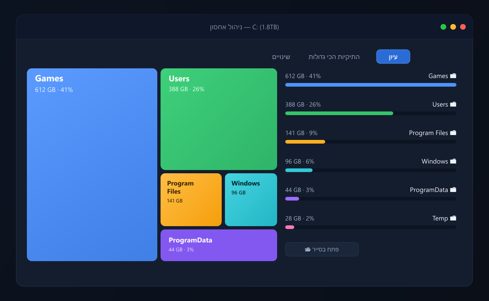

<div align="center">


# ניהול אחסון · disk-space-analyzer

### 💾 מצא מיד מה תופס לך מקום ב-Windows 11

סורק אחסון מהיר בממשק עברי — מפת ריבועים ויזואלית שקל לצלול לתוכה, בפקודת התקנה אחת.

<br />

[](https://github.com/MatanCH2020/disk-space-analyzer/releases/latest)
[](https://github.com/MatanCH2020/disk-space-analyzer/releases)
[](LICENSE)
[](https://github.com/MatanCH2020/disk-space-analyzer/releases/latest)

**[⬇️ הורדה ל-Windows](https://github.com/MatanCH2020/disk-space-analyzer/releases/latest) · [🌐 דף הבית](https://matanch2020.github.io/disk-space-analyzer/) · [📦 קוד המקור](https://github.com/MatanCH2020/disk-space-analyzer)**

<br />



</div>

<br />

<div align="center">

## ⚡ התקנה בפקודה אחת

פותחים **PowerShell** ומדביקים:

</div>

```powershell
irm https://raw.githubusercontent.com/MatanCH2020/disk-space-analyzer/main/install.ps1 | iex
```

<div align="center">

הפקודה מורידה את הגרסה האחרונה ומריצה את ההתקנה אוטומטית.
<br />
מעדיפים התקנה רגילה? הורידו את **[קובץ ה-Setup](https://github.com/MatanCH2020/disk-space-analyzer/releases/latest)** והריצו כמו כל תוכנה.

> ⚠️ האפליקציה אינה חתומה דיגיטלית — בהפעלה הראשונה ייתכן ש-SmartScreen יזהיר.
> לחצו **"מידע נוסף" → "הפעל בכל זאת"**. הקוד פתוח וניתן לבדיקה כאן.

</div>

<br />

<div align="center">

## ✨ יכולות

</div>

<table align="center">
<tr>
<td width="33%" valign="top" align="center">

### ⚡ סריקה מהירה
מנוע robocopy מקבילי סורק כונן מלא בכ-30 שניות — פי 3.5 מהיר מסריקה רגילה.

</td>
<td width="33%" valign="top" align="center">

### 🗂️ מפת ריבועים
כל תיקייה כריבוע בגודל יחסי — רואים בשנייה מה גדול, ולוחצים לצלול פנימה.

</td>
<td width="33%" valign="top" align="center">

### 📊 הכי גדולות
רשימה שטוחה של התיקיות הכבדות בכל הכונן, עם קפיצה ישירה.

</td>
</tr>
<tr>
<td width="33%" valign="top" align="center">

### 📈 השוואה לסריקה קודמת
רואים בדיוק מה גדל, מה התפנה ומה חדש מאז הפעם הקודמת.

</td>
<td width="33%" valign="top" align="center">

### 💾 שמירת סריקות
כל כונן זוכר את הסריקה האחרונה — חוזרים לתוצאות מיד, בלי לסרוק שוב.

</td>
<td width="33%" valign="top" align="center">

### 🛡️ בטוח לחלוטין
האפליקציה **לא מוחקת כלום** — רק מאתרת. "פתח בסייר" לכל פריט, והמחיקה בשליטתך.

</td>
</tr>
</table>

<br />

<div align="center">

## 🚀 איך זה עובד

**1.** מתקינים בפקודה אחת &nbsp;·&nbsp; **2.** סורקים כונן (~30 שניות) &nbsp;·&nbsp; **3.** מזהים תיקייה כבדה ולוחצים "פתח בסייר" למחיקה ידנית

<br />

## 🛠️ פיתוח והרצה מהמקור

</div>

דרוש [Node.js](https://nodejs.org/) 18+.

```bash
git clone https://github.com/MatanCH2020/disk-space-analyzer.git
cd disk-space-analyzer
npm install
npm start          # הרצה לפיתוח
npm run build      # בניית Setup.exe + portable לתיקיית dist/
```

<div align="center">

**איך זה בנוי:** Electron · מנוע סריקה מבוסס `robocopy /MT` ב-worker נפרד · Treemap עצמאי (אלגוריתם squarified) ללא תלויות חיצוניות.

<br />

מעוניינים בפירוט? ראו את [יומן השינויים](CHANGELOG.md).

<br />

נבנה עבור Windows 11 · קוד פתוח תחת רישיון [MIT](LICENSE)

</div>
